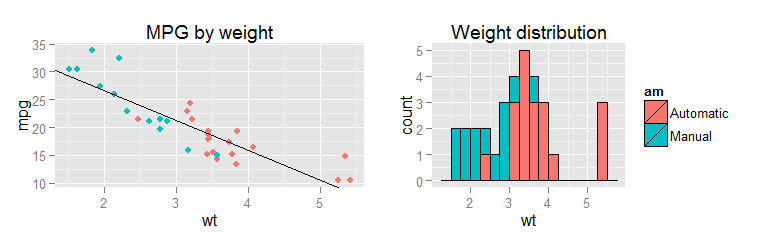
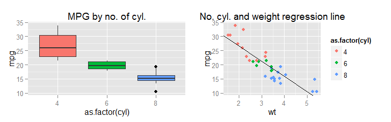
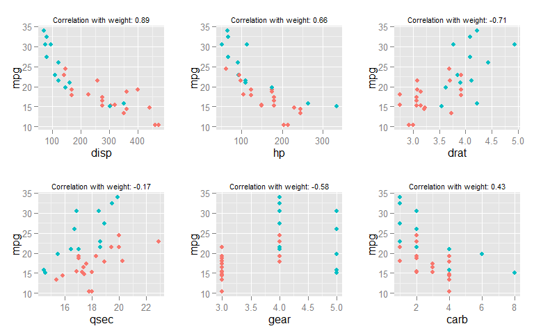
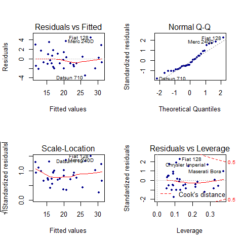

# Factors impacting miles per gallon - a regression analysis
## Context

You work for Motor Trend, a magazine about the automobile industry. Looking at a data set of a collection of cars, they are interested in exploring the relationship between a set of variables and miles per gallon (MPG) (outcome). They are particularly interested in the following two questions:

"Is an automatic or manual transmission better for MPG"
"Quantify the MPG difference between automatic and manual transmissions"

### Question

Take the mtcars data set and write up an analysis to answer their question using regression models and exploratory data analyses.

### Points to be evaluated

- Did the student interpret the coefficients correctly?
- Did the student fit multiple models and detail their strategy for model selection?
- Did the student answer the questions of interest or detail why the question(s) is (are) not answerable?
- Did the student do a residual plot and some diagnostics?
- Did the student quantify the uncertainty in their conclusions and/or perform an inference correctly?

## Executive summary

Though there is a difference in fuel consumption between automatic cars, this difference is explained by automatic cars being heavier than manual cars. The impact of the type of transmission for cars of the same weight is neglible for the analysed cars. If one wants to maximize miles per gallon focus should be layed on decreasing the weight of the car. 

## Data 
I have explored the mtcars data set, a data set containing information on fuel consumption in miles per gallon (mpg) and 10 aspects of car design and performance for 32 car models. The 10 included aspects were:  

- Number of cylinders
- Displacement (cu.in.)
- Gross horsepower (hp)
- Rear axle ratio 
- Weight (lb/1000)
- qseq 1/4 mile time
- Type of engine (straight or V-engine)
- Automatic or manual transmission
- Number of forward gears
- Number of carburetors

All of these aspects will be treated as numerical values except the engine and transmission types. 

## Exploratory analysis
I performed an exploratory analysis to investigate the properties of the data and get a first insight into what affects the fuel consumption and the differences between automatic and manual transmission. 

 

At first glance, it seems that transmission type has a clear effect on the fuel consumption. But it is possible that this apparent connection is driven by other properties of the cars. Figure X shows the relationship between weight and fuel consumption. As shown by the previous plot, fuel consumption for automatic cars (pink dots) is higher than that of manual cars, but we can also see that automatic cars tend to be heavier than manual cars. In fact, automatic cars do not seem to have higher fuel consumption than manual cars of similar weight. The black line shows the result of fitting a linear regression model for mpg depending only on weight. This simple model seems to capture the patterns for both automatic and manual cars reasonably well, but are there other traits of the data that could tell us more about the mpg?

 

From the plots exploring the relationship between the different variables and mpg I can not dismiss a relationship between any of them and mpg, but I can also not be sure of any relationships. Both number of cylinders and and engine type (V/S) look related to mpg when looking at them alone, but when also considering weight, it is not so clear anymore.   

 

The following 6 figures explore the relationship between mpg and the remaining 6 variables, displacement, horse power, read axle ratio, qsec, number of gears and number of carburetors. I have also computed the correlation between each variable and weight. Again, pink dots represent cars with automatic transmission and blue ones those with manual transmission. 

 

## Finding a representative model of the data 

Based on the strong relationship between weight and mpg identified, I will construct a linear regression model of mpg depending on weight. This is the same model already used in the exploratory analysis, and as we saw in that section, it gives us a negative relationship (slope = -5) between the mpg and weight. The R-squared for this model is 0.75. We can interpret this as 'weight explains 75% of the variance of mpg in the data'.  

                Estimate   Std. Error     t value   Pr(>|t|)
------------  ----------  -----------  ----------  ---------
(Intercept)    37.285126     1.877627   19.857575          0
wt             -5.344472     0.559101   -9.559044          0

I will now investigate if adding an interaction term between weight and transmission type to this model will improve it. The characteristics for this model can be seen in table 2. This model indicates that the relationship between weight and mpg is different between automatic and manual cars, with a stronger negative relationship for manual transmission cars. The R-squared now increases to 83% of variance explained. 

                Estimate   Std. Error     t value    Pr(>|t|)
------------  ----------  -----------  ----------  ----------
(Intercept)    31.416055    3.0201093   10.402291   0.0000000
wt             -3.785907    0.7856478   -4.818836   0.0000455
amManual       14.878422    4.2640422    3.489276   0.0016210
wt:amManual    -5.298361    1.4446993   -3.667449   0.0010171

Based on the results from the exploratory analysis I will also add the variable qsec, which was the variable with the lowest correlation with weight. In addition to this, I will construct a model that uses all variables. 

Table 4 displays the R-squared for these 4 models as well as the p value generated by an anova analysis comparing the models. 

Model name| Included variables|R-squared (%)| PR(>F)
------------- | -------------|-------------|-------------------
fit_wt | weight| 75|
fit_wt_am | weight \* transmissiontype| 83|0.0026919
fit_wt_am_qsec | weight \* transmissiontype + qsec| 90|0.0019822
fit_wt_am_all | weight \* transmissiontype + all remaining variables| 90|0.9939286

We can see from this analysis that there is no evidence that including all variables gives us a more accurate model than the one we get when including only weight, transmission type and qsec. It can be noted that they both have an R-squared of 90%. Based on these results, I will select model number three. The coefficients of this model are:

                Estimate   Std. Error     t value    Pr(>|t|)
------------  ----------  -----------  ----------  ----------
(Intercept)     9.723053    5.8990407    1.648243   0.1108925
wt             -2.936531    0.6660253   -4.409038   0.0001489
amManual       14.079428    3.4352512    4.098515   0.0003409
qsec            1.016974    0.2520152    4.035366   0.0004030
wt:amManual    -4.141376    1.1968119   -3.460340   0.0018086

## Is there a significant difference in mpg between automatic and manual transmission cars

Under the selected model, there is a difference in estimated mpg between automatic and manual cars. If weight and qsec is held constant, manual cars are expected to have a mpg of 14.1 more than automatic cars. The difference in mpg between automatic and manual cars is significant with p=3\times 10^{-4}. 

What to do about dependence of weight on mpg for automatic/non-automatic?

For mean qsec and mean weight the mpg is almost the same, so it does not look significant. What if I negelect the interaction term?

There is some difference between manual and automatic cars, where the dependence between weight and mpg is greater for manual cars than for automatic ones. 

## Diagnostics of model 
There is no obvious pattern in the residuals, the model does not seem to be biased. There is no single data point that has an extreme influence on the model. 

 
 

TODO: 

- Investigate outliers? 
- Remove effect of weight and plot mpg for automatic/manual to show that we can't see a difference 
- Write executive summary
- Expand on the diagnostocs of the model

