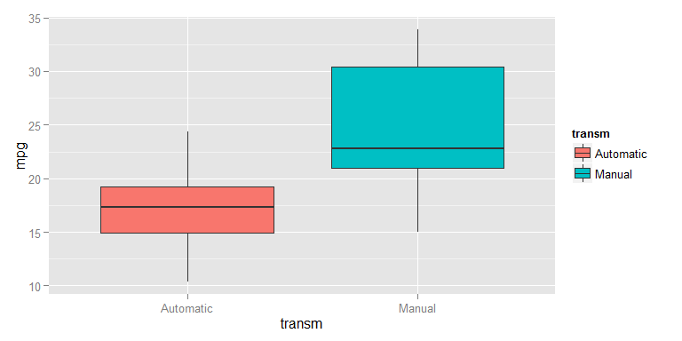
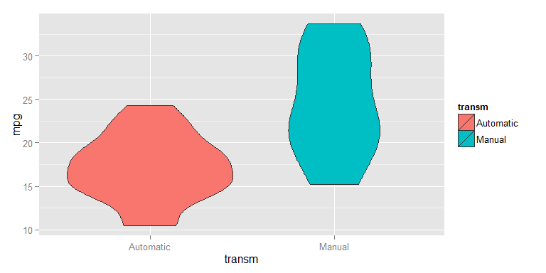
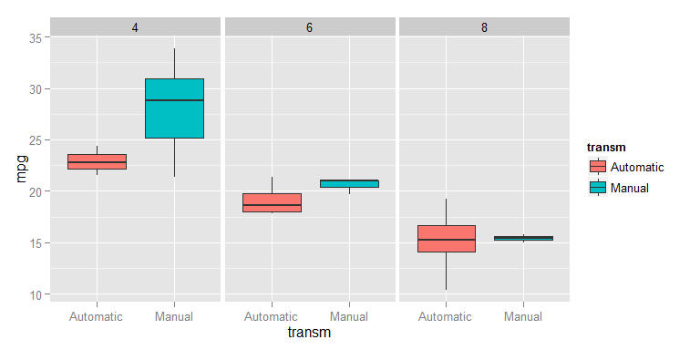
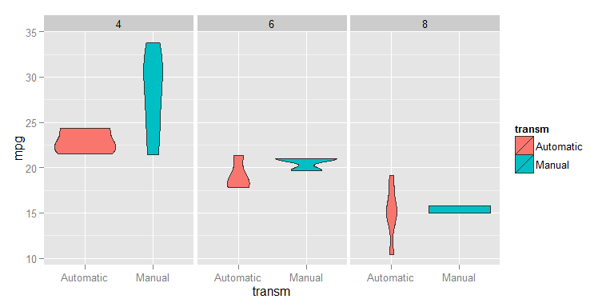
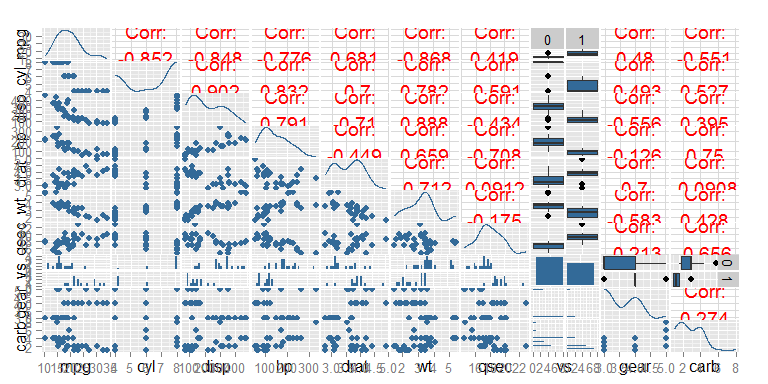

# Regression models - Factors impacting miles per gallon
## Context

You work for Motor Trend, a magazine about the automobile industry. Looking at a data set of a collection of cars, they are interested in exploring the relationship between a set of variables and miles per gallon (MPG) (outcome). They are particularly interested in the following two questions:

"Is an automatic or manual transmission better for MPG"
"Quantify the MPG difference between automatic and manual transmissions"

### Question

Take the mtcars data set and write up an analysis to answer their question using regression models and exploratory data analyses.

### Points to be evaluated

- Did the student interpret the coefficients correctly?
- Did the student interpret the coefficients correctly?
- Did the student fit multiple models and detail their strategy for model selection?
- Did the student answer the questions of interest or detail why the question(s) is (are) not answerable?
- Did the student do a residual plot and some diagnostics?
- Did the student quantify the uncertainty in their conclusions and/or perform an inference correctly?

## Executive summary


## Exploratory analysis


```
##       mpg             cyl             disp             hp       
##  Min.   :10.40   Min.   :4.000   Min.   : 71.1   Min.   : 52.0  
##  1st Qu.:15.43   1st Qu.:4.000   1st Qu.:120.8   1st Qu.: 96.5  
##  Median :19.20   Median :6.000   Median :196.3   Median :123.0  
##  Mean   :20.09   Mean   :6.188   Mean   :230.7   Mean   :146.7  
##  3rd Qu.:22.80   3rd Qu.:8.000   3rd Qu.:326.0   3rd Qu.:180.0  
##  Max.   :33.90   Max.   :8.000   Max.   :472.0   Max.   :335.0  
##       drat             wt             qsec       vs           am        
##  Min.   :2.760   Min.   :1.513   Min.   :14.50   0:18   Min.   :0.0000  
##  1st Qu.:3.080   1st Qu.:2.581   1st Qu.:16.89   1:14   1st Qu.:0.0000  
##  Median :3.695   Median :3.325   Median :17.71          Median :0.0000  
##  Mean   :3.597   Mean   :3.217   Mean   :17.85          Mean   :0.4062  
##  3rd Qu.:3.920   3rd Qu.:3.610   3rd Qu.:18.90          3rd Qu.:1.0000  
##  Max.   :4.930   Max.   :5.424   Max.   :22.90          Max.   :1.0000  
##       gear            carb             transm  
##  Min.   :3.000   Min.   :1.000   Automatic:19  
##  1st Qu.:3.000   1st Qu.:2.000   Manual   :13  
##  Median :4.000   Median :2.000                 
##  Mean   :3.688   Mean   :2.812                 
##  3rd Qu.:4.000   3rd Qu.:4.000                 
##  Max.   :5.000   Max.   :8.000
```

```
## 'data.frame':	32 obs. of  12 variables:
##  $ mpg   : num  21 21 22.8 21.4 18.7 18.1 14.3 24.4 22.8 19.2 ...
##  $ cyl   : num  6 6 4 6 8 6 8 4 4 6 ...
##  $ disp  : num  160 160 108 258 360 ...
##  $ hp    : num  110 110 93 110 175 105 245 62 95 123 ...
##  $ drat  : num  3.9 3.9 3.85 3.08 3.15 2.76 3.21 3.69 3.92 3.92 ...
##  $ wt    : num  2.62 2.88 2.32 3.21 3.44 ...
##  $ qsec  : num  16.5 17 18.6 19.4 17 ...
##  $ vs    : Factor w/ 2 levels "0","1": 1 1 2 2 1 2 1 2 2 2 ...
##  $ am    : num  1 1 1 0 0 0 0 0 0 0 ...
##  $ gear  : num  4 4 4 3 3 3 3 4 4 4 ...
##  $ carb  : num  4 4 1 1 2 1 4 2 2 4 ...
##  $ transm: Factor w/ 2 levels "Automatic","Manual": 2 2 2 1 1 1 1 1 1 1 ...
```

    

```
## stat_bin: binwidth defaulted to range/30. Use 'binwidth = x' to adjust this.
## stat_bin: binwidth defaulted to range/30. Use 'binwidth = x' to adjust this.
## stat_bin: binwidth defaulted to range/30. Use 'binwidth = x' to adjust this.
## stat_bin: binwidth defaulted to range/30. Use 'binwidth = x' to adjust this.
## stat_bin: binwidth defaulted to range/30. Use 'binwidth = x' to adjust this.
## stat_bin: binwidth defaulted to range/30. Use 'binwidth = x' to adjust this.
## stat_bin: binwidth defaulted to range/30. Use 'binwidth = x' to adjust this.
## stat_bin: binwidth defaulted to range/30. Use 'binwidth = x' to adjust this.
## stat_bin: binwidth defaulted to range/30. Use 'binwidth = x' to adjust this.
## stat_bin: binwidth defaulted to range/30. Use 'binwidth = x' to adjust this.
## stat_bin: binwidth defaulted to range/30. Use 'binwidth = x' to adjust this.
## stat_bin: binwidth defaulted to range/30. Use 'binwidth = x' to adjust this.
## stat_bin: binwidth defaulted to range/30. Use 'binwidth = x' to adjust this.
## stat_bin: binwidth defaulted to range/30. Use 'binwidth = x' to adjust this.
## stat_bin: binwidth defaulted to range/30. Use 'binwidth = x' to adjust this.
## stat_bin: binwidth defaulted to range/30. Use 'binwidth = x' to adjust this.
## stat_bin: binwidth defaulted to range/30. Use 'binwidth = x' to adjust this.
## stat_bin: binwidth defaulted to range/30. Use 'binwidth = x' to adjust this.
```

  

```
## stat_bin: binwidth defaulted to range/30. Use 'binwidth = x' to adjust this.
## stat_bin: binwidth defaulted to range/30. Use 'binwidth = x' to adjust this.
## stat_bin: binwidth defaulted to range/30. Use 'binwidth = x' to adjust this.
## stat_bin: binwidth defaulted to range/30. Use 'binwidth = x' to adjust this.
## stat_bin: binwidth defaulted to range/30. Use 'binwidth = x' to adjust this.
## stat_bin: binwidth defaulted to range/30. Use 'binwidth = x' to adjust this.
## stat_bin: binwidth defaulted to range/30. Use 'binwidth = x' to adjust this.
## stat_bin: binwidth defaulted to range/30. Use 'binwidth = x' to adjust this.
## stat_bin: binwidth defaulted to range/30. Use 'binwidth = x' to adjust this.
## stat_bin: binwidth defaulted to range/30. Use 'binwidth = x' to adjust this.
## stat_bin: binwidth defaulted to range/30. Use 'binwidth = x' to adjust this.
## stat_bin: binwidth defaulted to range/30. Use 'binwidth = x' to adjust this.
## stat_bin: binwidth defaulted to range/30. Use 'binwidth = x' to adjust this.
## stat_bin: binwidth defaulted to range/30. Use 'binwidth = x' to adjust this.
## stat_bin: binwidth defaulted to range/30. Use 'binwidth = x' to adjust this.
## stat_bin: binwidth defaulted to range/30. Use 'binwidth = x' to adjust this.
## stat_bin: binwidth defaulted to range/30. Use 'binwidth = x' to adjust this.
## stat_bin: binwidth defaulted to range/30. Use 'binwidth = x' to adjust this.
```

 


## Testing of mpg difference between automatic and manual transmissions
